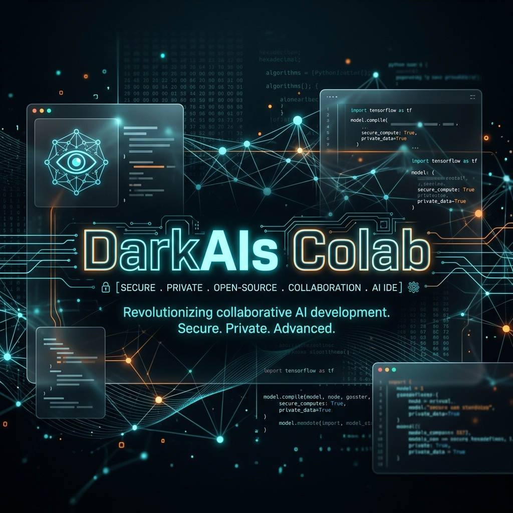
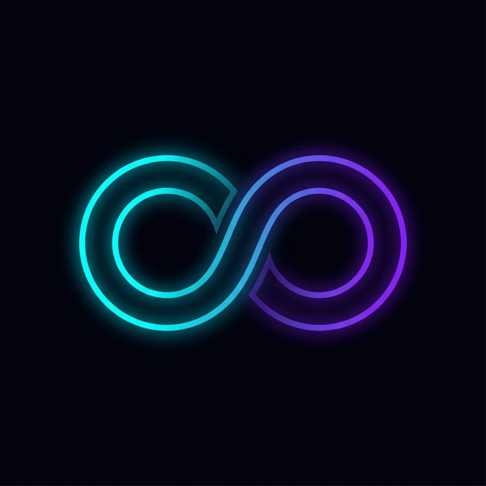

<div align="center">
  
  <br/><br/>
  
  <h1>DarkAIs Colab</h1>
  <h3>The Ultimate Privacy-First, Local AI Execution Environment</h3>

  <p align="center">
    <a href="https://huggingface.co/spaces/karidasd/DarkAIs-Colab"></a>
    <a href="https://reactjs.org/"></a>
    <a href="https://fastapi.tiangolo.com/"></a>
    <a href="https://www.python.org/"></a>
    <a href="https://opensource.org/licenses/MIT"></a>
  </p>
</div>

<br/>

**DarkAIs Colab** is a premium, open-source alternative to Jupyter Notebooks and Google Colab, crafted specifically for the modern developer. It is designed to run locally on your machine, ensuring **100% data privacy** while fully utilizing your local hardware (GPU/CPU). 

Forget the plain, boring interfaces. DarkAIs Colab features a stunning **Glassmorphism Dark UI**, an integrated **HuggingFace AI Copilot**, and a robust Python execution engine with persistent kernel memory.

---

## ✨ Key Features

| Feature | Description |
| :--- | :--- |
| **🧠 Persistent Kernel Memory** | Run Python code step-by-step. Variables, functions, and imports persist across cells, exactly like a real data science notebook. |
| **📊 Matplotlib DataViz** | Advanced `Base64` extraction layer automatically captures and renders your Python plots directly in the browser—no annoying popup windows! |
| **📦 Magic Commands** | Execute terminal commands directly inside the cells (e.g. `!pip install numpy`). The backend parses and pipes the output in real-time. |
| **📂 Workspace File Browser** | Built-in UI to upload, read, and manage datasets (CSV, JSON, Images). Your Python code can process them instantly from the `workspace/` directory. |
| **🤖 AI Copilot Integration** | Chat with HuggingFace's top-tier open-source models directly inside your IDE without ever switching tabs. |
| **🔒 Enterprise Security** | Password-protect code execution (`DARK_PASS`) when deploying publicly to the web. |

---

## ⚡ Why DarkAIs Colab?

| Feature | DarkAIs Colab | Google Colab | Jupyter Notebook |
| :--- | :---: | :---: | :---: |
| **100% Local Privacy** | ✅ | ❌ | ✅ |
| **Modern Glass UI** | ✅ | ❌ | ❌ |
| **Built-in AI Copilot** | ✅ | ✅ (Paid) | ❌ |
| **HuggingFace Deployment** | ✅ (Native) | ❌ | ❌ |

---

## 🛠️ Installation & Setup (Local)

### Prerequisites
- Python 3.10+
- Node.js & npm

### 1. Clone & Start the Backend
```bash
git clone https://github.com/karidasd/DarkAIs-Colab.git
cd DarkAIs-Colab/backend
pip install -r requirements.txt
python -m uvicorn main:app --reload
```
*The execution engine will start at `http://localhost:8000`.*

### 2. Start the Glassmorphism UI
Open a new terminal:
```bash
cd DarkAIs-Colab/frontend
npm install
npm run dev
```
*The stunning UI will open at `http://localhost:5173`.*

---

## 🐳 Docker Deployment (Production)
We've included a production-ready `Dockerfile` that combines the compiled React frontend and the FastAPI backend into a single container running on port `7860` (perfect for **HuggingFace Spaces** or **Render**).

1. **Build the UI:** `cd frontend && npm run build`
2. **Build Docker Image:** `docker build -t darkais-colab .`
3. **Run Container:** `docker run -p 7860:7860 darkais-colab`

> **Security Note**: Set the `DARK_PASS` environment variable in your production environment (e.g. HuggingFace Secrets) to lock code execution. The default password is `DarkAIs2026!`.

---

<div align="center">
  <b>Designed with ❤️ by karidasd</b><br/>
  <i>Empowering developers with beautiful, private AI tools.</i>
</div>
